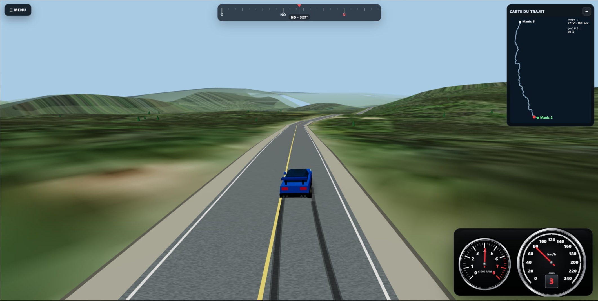

# World Drive V21.20.1

**World Drive** est un simulateur de conduite 3D construit avec **Three.js** et **Vite**, jouable dans le navigateur et disponible comme application **Windows/Electron**.

Le projet combine des routes réelles, du relief, de l’imagerie, des données OpenStreetMap, plusieurs véhicules procéduraux, une physique de conduite semi-réaliste, de l’audio moteur dynamique et un mode multijoueur LAN sans collisions.

La **V21.20.1** consolide la physique et l’instrumentation de la V20, améliore fortement la génération des routes et du terrain en montagne extrême, stabilise les points de départ et ajoute une version Windows avec **multijoueur LAN intégré** et accès OSM adapté à Electron.

---

## Aperçu visuel

<p align="center">
  
</p>

<p align="center">
  <em>Conduite sur route réelle avec relief, imagerie, carte du trajet et instrumentation dynamique.</em>
</p>

---

## Statut

**V21.20.1 · stable**

Workflow Git :

```text
dev   → développement et tests
main  → version stable
```

La version Windows distribuée est produite avec **Electron Forge**. Le numéro de version applicatif actuel est `21.20.1`.

---

# Nouveautés V21.20.1

## Version Windows

- Application desktop Electron native pour Windows
- **Héberger une session** multijoueur directement depuis le menu
- **Se connecter** à une session LAN par adresse IP ou nom du PC
- Relais WebSocket embarqué sur le port TCP `8081`
- Adresse IPv4 LAN de l’hôte affichée dans l’interface
- Proxy local Electron/Node pour les requêtes Overpass
- Origine locale stable `127.0.0.1:17317` lorsque disponible, afin de conserver IndexedDB, caches et réglages entre les lancements
- Fallback automatique vers un port local dynamique si `17317` est déjà occupé

## Routes et terrain

- Maillage routier renforcé dans les épingles, lacets et changements de direction extrêmes
- Accotements et lignes de route construits avec un repère transversal commun
- Limitation des raccords géométriques anormalement longs dans les virages serrés
- Terrain mieux adapté aux routes superposées à différentes altitudes
- Réduction des artefacts triangulaires sur les reliefs extrêmes
- Départ des trajets stabilisé avec une zone plane et une transition progressive vers la pente réelle

## OSM / monde dynamique

- Hydrographie et décor réel fonctionnent aussi dans la version Windows via le proxy local Electron
- Le navigateur/Vite continue d’interroger Overpass directement
- Les réponses OSM réussies sont mises en cache dans IndexedDB
- Le premier chargement du **Décor réel** peut être sensiblement plus long dans les régions très détaillées; les chargements suivants profitent du cache

---

# Fonctionnalités principales

## Monde et routes

- Routes réelles et création de trajets
- Recherche de lieux et géocodage
- Presets de routes québécoises
- Relief basé sur des données d’élévation
- Imagerie aérienne / satellite
- Mode terrain topographique lorsque l’imagerie est désactivée
- Eau, rivières, lacs, ponts, bâtiments, forêt et décor OSM
- Panneaux routiers et métadonnées de route
- Limites de vitesse OSM
- Streaming dynamique du monde autour du joueur
- Cache persistant IndexedDB
- Floating origin pour conserver une bonne précision sur les longs trajets

---

# Physique de conduite

## Suspension et contact au sol

Chaque roue possède maintenant son propre état de suspension.

- Suspension indépendante aux quatre roues
- Échantillonnage individuel du sol / de la route
- Compression et détente propres à chaque roue
- Dévers et pente suivis localement
- Roues maintenues au contact visuel du sol
- Tangage et roulis de la carrosserie
- Compression visible lors des atterrissages
- Ombre procédurale sous le véhicule

La carrosserie n’est plus simplement collée verticalement à la route.

## Véhicule en l’air

Une voiture peut maintenant réellement quitter le sol lorsqu’elle franchit trop rapidement :

- une bosse
- une crête
- une rupture importante de pente

Pendant le saut :

- la gravité agit sur le véhicule
- la direction devient presque inactive
- l’assistance de maintien de voie est désactivée
- la voiture suit une trajectoire balistique
- la suspension se comprime visuellement à l’atterrissage

---

## Adhérence des pneus

L’adhérence est estimée individuellement pour les quatre roues.

Le système tient compte notamment de :

- accélération latérale
- accélération / freinage
- transfert de charge approximatif
- type de transmission
- frein à main
- surface route / terrain

Les traces de pneus et les sons de crissement utilisent cette estimation d’adhérence plutôt qu’une simple valeur théorique basée sur le volant.

### Comportement en virage

Le modèle de conduite sépare :

- la saturation latérale des pneus
- le stress longitudinal accélération / freinage
- le sous-virage
- le survirage
- la glisse des quatre roues

Un freinage puissant en ligne droite ne provoque donc plus artificiellement un survirage.

### Drift / survirage

Le cap du véhicule et la direction réelle de déplacement peuvent se séparer.

Lorsqu’un essieu arrière perd davantage d’adhérence :

- l’arrière dérive vers l’extérieur
- la trajectoire accuse un retard par rapport au cap
- le véhicule prend un angle de glisse visible
- le comportement dépend du type de transmission et du véhicule

---

## Direction haute vitesse

La direction est progressivement filtrée avec la vitesse.

À basse vitesse, la voiture répond rapidement.

À haute vitesse :

- les petits mouvements de stick deviennent plus précis
- la réponse du lacet est plus lente
- la voiture ne pivote plus instantanément à son maximum de grip
- un virage trop rapide peut provoquer du sous-virage ou une glisse globale

Le plein braquage reste disponible si le joueur maintient réellement le stick au maximum.

---

# Transmission

World Drive possède maintenant une vraie logique de transmission pour les véhicules thermiques.

## Modes

Deux modes sont disponibles :

- **Automatique** — mode par défaut
- **Manuelle**

Le mode est sélectionnable directement dans l’interface.

## Rapports mécaniques

Les voitures thermiques utilisent maintenant :

- un régime de ralenti
- un régime maximal
- des ratios de boîte
- un nombre de rapports
- un temps de passage propre au véhicule

La vitesse maximale n’est plus imposée par un simple `topSpeed`.

Elle découle du :

```text
régime maximal
×
ratio du dernier rapport
×
calibration de la transmission
```

Modifier les ratios ou le redline modifie donc automatiquement la vitesse mécanique possible.

### Calibration actuelle

| Véhicule | Référence top-gear au redline |
|---|---:|
| Subaru WRX | 225 km/h |
| Honda Civic | 180 km/h |
| Hyundai Sonata Sport | 205 km/h |
| F1 2010 | 350 km/h |
| Lamborghini Countach | 320 km/h |

Ces valeurs servent de **calibration mécanique**, pas de plafond artificiel.

La puissance du moteur, la résistance au roulement et la traînée aérodynamique peuvent empêcher un véhicule d’atteindre sa vitesse théorique.

---

## Passage des rapports

Pendant un changement de vitesse :

- la propulsion est momentanément coupée
- le régime moteur descend ou monte vers celui du rapport suivant
- l’audio suit exactement le même régime
- l’indicateur de rapport affiche le changement
- le temps de passage dépend du véhicule

Exemples de temps de montée de rapport :

| Véhicule | Temps approximatif |
|---|---:|
| F1 2010 | 0,075 s |
| Subaru WRX | 0,160 s |
| Hyundai Sonata | 0,180 s |
| Honda Civic | 0,220 s |
| Lamborghini Countach | 0,280 s |

---

## Rev limiter

Lorsque le moteur atteint son régime maximal :

- l’allumage / la propulsion est coupé puis réappliqué rapidement
- le RPM oscille sous le redline
- l’aiguille du tachymètre oscille
- le son moteur suit le même régime
- l’instrumentation affiche `LIMIT`

En transmission manuelle, le limiteur peut être atteint dans **n’importe quel rapport**.

Un rétrogradage qui provoquerait un sur-régime important est refusé.

---

# Hors route

Le terrain réduit fortement les performances.

Pour tous les véhicules :

- accélération réduite d’environ 20 %

Pour les thermiques :

- régime maximal effectif réduit de 30 %
- chaque rapport atteint donc son redline à une vitesse plus faible
- résistance supplémentaire si la voiture arrive sur le terrain beaucoup trop vite

Pour les AWD :

- avantage supplémentaire d’adhérence hors route

Les véhicules électriques gardent leur logique de limitation électronique, puisqu’ils n’utilisent pas de transmission thermique à rapports.

---

# Instrumentation

Depuis la V20, World Drive possède un combiné d’instruments entièrement dessiné en Canvas.

Aucun asset d’image n’est nécessaire.

Le cluster comprend :

- tachymètre à gauche
- compteur de vitesse principal à droite
- anneaux métalliques / chromés
- graduations blanches
- aiguilles rouges
- zone rouge moteur
- rapport engagé intégré dans le compteur
- indicateur `AUTO` / `MAN`
- indicateur `SHIFT`
- indicateur `LIMIT`

Pour les véhicules électriques, le tachymètre affiche simplement **EV** au lieu d’inventer un faux régime moteur.

---

# Audio

Le système audio est synchronisé avec la physique et la transmission.

## Moteur

Les véhicules thermiques utilisent :

- régime moteur réel
- rapport engagé
- variation de RPM pendant les shifts
- coupure de régime au limiteur

Le changement de rapport modifie donc réellement la fréquence du moteur.

### F1 2010

La F1 conserve son moteur V8 synthétique :

- ralenti élevé
- redline à 12 000 RPM
- 7 rapports
- caractère sombre / agressif
- aucune dépendance à un sample moteur externe

## Pneus

- crissement basé sur la saturation réelle d’adhérence
- traces et sons peuvent apparaître roue par roue
- freinage longitudinal séparé de la glisse latérale

Samples utilisés :

```text
assets/audio/tire-squeal.mp3
assets/audio/brake-squeal.mp3
```

---

# Véhicules disponibles

| Véhicule | Transmission | Caractère |
|---|---|---|
| Volkswagen ID.4 | VÉ AWD | Stable, progressif |
| Subaru WRX | AWD | Sportive, vive, très bonne traction |
| Honda Civic noire | FWD | Compacte traction |
| Hyundai Sonata Sport blanche | FWD | Berline routière |
| BMW i3 2017 | VÉ RWD | Électrique légère propulsion |
| Lamborghini Countach 80s | RWD | V12 old-school, survirage plus présent |
| F1 2010 | RWD | Très forte adhérence, réponse très rapide |

Les modèles sont générés procéduralement dans le code.

---

# Contrôles

## Clavier

| Touche | Action |
|---|---|
| `W` / `↑` | Accélérer |
| `S` / `↓` | Freiner / reculer |
| `A` / `←` | Tourner à gauche |
| `D` / `→` | Tourner à droite |
| `Espace` | Frein à main |
| `]` | Rapport supérieur en mode manuel |
| `[` | Rapport inférieur en mode manuel |
| `C` | Changer de caméra |
| `L` | Assistance route ON / OFF |
| `P` | Pilote automatique ON / OFF |
| `R` | Replacer la voiture sur la route |

---

## Manette Xbox / compatible

| Commande | Action |
|---|---|
| Stick gauche | Direction |
| Stick droit | Caméra libre |
| RT | Accélérateur |
| LT | Frein / marche arrière |
| A | Rapport supérieur en mode manuel |
| X | Rapport inférieur en mode manuel |
| B | Frein à main |
| Y | Changer de caméra |
| View / Back | Pilote automatique ON / OFF |
| R3 | Vue arrière tant que le bouton est tenu |
| Menu / Start | Replacer la voiture sur la route |

En mode automatique, `A` et `X` n’imposent pas de changement de rapport.

---

# Assistance et pilote automatique

## Assistance route

Lorsque l’assistance est activée et que le joueur ne touche pratiquement pas à la direction :

- le véhicule corrige doucement sa trajectoire
- une vraie entrée manuelle reprend immédiatement priorité
- l’assistance est désactivée lorsque la voiture est en l’air

## Pilote automatique

Le pilote automatique peut :

- suivre le trajet
- anticiper les virages
- réduire sa vitesse en fonction de la courbure
- respecter les limites de vitesse si l’option correspondante est activée
- ralentir à l’approche de la destination

---

# Skid marks

Les traces de pneus utilisent un pool partagé basé sur `InstancedMesh`.

## Local

- décision par roue
- apparition seulement après une perte d’adhérence suffisante
- délai pour éviter de tracer au moindre stress
- frein à main arrière plus immédiat

## Multijoueur

Le réseau transmet seulement une information compacte de glisse avant / arrière.

La géométrie des traces est recréée localement.

Le pool est suffisamment grand pour garder les traces visibles pendant un certain temps sans recycler immédiatement les plus récentes.

---

# Multijoueur LAN

World Drive possède un mode multijoueur LAN léger.

Chaque ordinateur simule **sa propre voiture localement**.

Le serveur WebSocket ne fait que relayer l’état des joueurs.

## Principes

- plusieurs joueurs simultanés
- position basée sur latitude / longitude
- environ 20 mises à jour réseau par seconde
- interpolation par snapshots côté client
- courte extrapolation entre deux états
- modèle exact du véhicule distant
- suspension et support du sol recalculés localement
- phares distants
- feux de freinage distants
- traces de pneus distantes
- aucune physique véhicule sur le serveur
- **aucune collision entre joueurs**

L’absence de collisions est volontaire afin de garder le multijoueur léger et robuste.

---

## Lancer une partie LAN

### Application Windows — méthode recommandée

Aucun terminal n’est nécessaire.

Sur le PC hôte :

1. Ouvrir **Menu > Multijoueur**.
2. Cliquer **Héberger une session**.
3. Noter l’adresse affichée, par exemple `192.168.1.20`.
4. Si Windows le demande, autoriser World Drive sur le réseau privé.

Sur les autres PC :

1. Ouvrir **Menu > Multijoueur**.
2. Entrer l’adresse IP de l’hôte, par exemple `192.168.1.20`.
3. Cliquer **Se connecter**.

Le serveur LAN utilise par défaut le port TCP :

```text
8081
```

Le bouton **Arrêter** ferme proprement l’hébergement ou la connexion active.

### Navigateur / développement Vite

Le mode historique reste disponible pour le développement. Sur le PC hôte :

```bash
node server/multiplayer-server.mjs
npm run dev -- --host 0.0.0.0
```

Les autres ordinateurs ouvrent ensuite :

```text
http://ADRESSE_IP_DU_PC_HOTE:5173
```

Le client multijoueur utilise le port `8081` pour le WebSocket. Au besoin, autoriser les ports **5173** et **8081** dans le pare-feu du PC hôte.

---

# Challenge de trajet

La carte du trajet contient un mode challenge léger.

- **Temps** : démarre lorsque la voiture commence à rouler
- **Qualité** : commence à 100 %
- Chaque seconde complète passée hors route retire 1 point de qualité
- Le challenge se termine à l’arrivée

---

# Installation

## Utilisateur Windows

La méthode recommandée est d’utiliser l’une des archives publiées dans les **GitHub Releases** :

- `WorldDriveSetup.exe` — installateur Windows
- archive `.zip` — version portable

La version Windows nécessite une connexion Internet pour récupérer les données géographiques qui ne sont pas encore présentes dans les caches locaux.

## Développement

### Prérequis

- Node.js LTS
- npm
- navigateur moderne avec WebGL pour le mode web

### Premier lancement web

```bash
npm install
npm run dev
```

Vite affiche généralement :

```text
http://localhost:5173
```

### Tester l’application Windows

```powershell
npm run desktop
```

Cette commande construit d’abord le projet Vite, puis ouvre l’application Electron.

---

# Build et release Windows

## Build web

```bash
npm run build
```

Le résultat est généré dans `dist/`.

## Générer les paquets Windows

```powershell
npm run make
```

ou :

```text
BUILD_WINDOWS_RELEASE.bat
```

Electron Forge génère les artefacts sous :

```text
out\make\
```

Les sorties attendues comprennent notamment l’installateur Squirrel Windows et une archive ZIP portable.

## Publication GitHub

Exemple pour taguer la version stable :

```powershell
git tag -a v21.20.1 -m "World Drive V21.20.1"
git push origin v21.20.1
```

Ensuite, créer une **GitHub Release** à partir du tag `v21.20.1` et joindre l’installateur ainsi que le ZIP portable générés par `npm run make`.

---

# Architecture

`main.js` reste l’orchestrateur principal, mais les gros systèmes sont séparés en modules spécialisés.

```text
world-drive/
│
├── index.html
├── package.json
├── START_WORLD_DRIVE.bat
├── BUILD_WINDOWS_RELEASE.bat
├── forge.config.cjs
├── vite.config.js
│
├── electron/
│   ├── main.cjs
│   ├── preload.cjs
│   └── multiplayer-runtime.cjs
│
├── server/
│   └── multiplayer-server.mjs
│
└── src/
    ├── main.js
    ├── styles.css
    │
    ├── vehicle-system.js
    ├── vehicle-visuals.js
    ├── vehicle-presentation.js
    │
    ├── audio.js
    ├── gamepad.js
    ├── skidmarks.js
    │
    ├── multiplayer.js
    ├── multiplayer-visuals.js
    │
    ├── camera.js
    ├── routing.js
    ├── routing-service.js
    ├── geocoding.js
    │
    ├── terrain.js
    ├── elevation.js
    ├── imagery.js
    │
    ├── water-data.js
    ├── water-renderer.js
    ├── scenery-data.js
    ├── scenery-renderer.js
    ├── bridges.js
    ├── signs.js
    │
    ├── overpass.js
    ├── cache.js
    └── world-streaming.js
```

---

## Responsabilités principales

### `main.js`

Coordonne :

- boucle principale
- état de conduite
- adhérence
- transmission
- HUD
- instrumentation
- intégration des sous-systèmes

### `vehicle-system.js`

Contient :

- registre des véhicules
- paramètres physiques
- type de transmission
- ratios de boîte
- redline
- temps de passage
- paramètres de suspension

### `vehicle-visuals.js`

Gère :

- modèles procéduraux
- roues
- phares
- feux
- présentation visuelle du véhicule local

### `vehicle-presentation.js`

Gère :

- suspension indépendante
- position verticale
- décollage / atterrissage
- roulis
- tangage
- dévers
- contact des roues
- ombre du véhicule

### `audio.js`

Gère :

- profils moteurs
- calcul du régime
- transmission
- sons de pneus
- sons de freinage
- V8 synthétique F1

### `gamepad.js`

Gère :

- lecture de la manette
- sticks
- triggers
- boutons
- vue arrière
- transmission manuelle

### `skidmarks.js`

Gère les traces de pneus locales et distantes via un `InstancedMesh` partagé.

### `multiplayer.js`

Gère la synchronisation réseau des joueurs.

### `multiplayer-visuals.js`

Reproduit localement :

- véhicules distants
- labels
- phares
- freinage
- support au sol
- suspension

### `electron/main.cjs`

Gère la version desktop Windows :

- serveur statique local
- fenêtre Electron
- proxy OSM / Overpass
- origine locale persistante
- IPC multijoueur

### `electron/multiplayer-runtime.cjs`

Gère l’hébergement LAN et le relais local utilisé pour rejoindre une session distante depuis Electron.

### `world-streaming.js`

Coordonne le chargement dynamique des éléments du monde autour de la voiture.

---

# Performance

Le projet utilise plusieurs optimisations :

- `InstancedMesh` pour les éléments répétés
- pool circulaire pour les skid marks
- chargement visuel différé / coalescé
- préchargement directionnel
- cache IndexedDB
- floating origin
- aucune physique multijoueur côté serveur
- aucune collision réseau
- phares distants sans calcul coûteux d’ombres
- réutilisation des géométries pour les véhicules distants

---

# Données et services externes

World Drive utilise ou peut utiliser des données provenant notamment de :

- OpenStreetMap
- Overpass
- services de routage
- services d’élévation
- imagerie cartographique

La précision et la disponibilité des données peuvent varier selon la région. Dans Electron, les requêtes Overpass passent par le proxy local Node intégré; dans le navigateur, elles sont effectuées directement par le client web.

---

# V21.20.1 — résumé

La V21.20.1 stabilise et regroupe notamment :

- application Windows Electron distribuable
- hébergement et connexion multijoueur LAN directement dans le menu
- proxy OSM/Overpass spécifique à Windows
- cache IndexedDB persistant grâce à une origine desktop stable
- génération routière robuste dans les lacets et reliefs extrêmes
- corrections des artefacts de terrain près des routes superposées
- zone de départ plane sur les trajets difficiles
- physique verticale et suspension indépendante aux quatre roues
- adhérence, glisse et skid marks roue par roue
- transmission automatique / manuelle et rapports mécaniques
- instrumentation Canvas et audio moteur dynamique
- streaming du relief, de l’imagerie, de l’hydrographie et du décor OSM

**V21.20.1 est la version stable actuelle de World Drive.**
