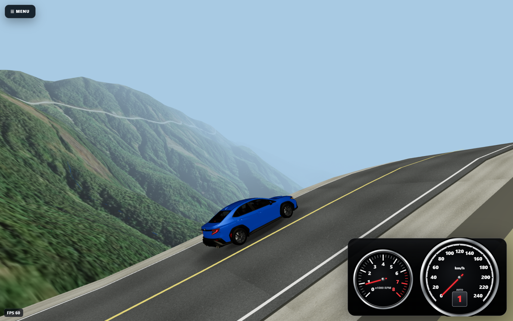

# World Drive

**World Drive** est un simulateur de conduite 3D qui permet de prendre la route presque n’importe où dans le monde à partir de données géographiques réelles.

Construit avec **Three.js**, **Vite** et **Electron**, le projet combine routes OpenStreetMap, relief réel, imagerie satellite, génération procédurale du terrain, physique automobile, véhicules 3D détaillés et streaming dynamique du monde pour créer une expérience de conduite libre sur des trajets réels.

Le but n’est pas de reproduire une seule carte fermée, mais de construire le monde autour du joueur à partir du trajet choisi.

## Fonctionnalités principales

- **Routes et trajets réels** avec recherche de lieux, géocodage et données OpenStreetMap.
- **Relief basé sur des données d’élévation réelles**, avec terrain proche, moyen et lointain généré dynamiquement.
- **Imagerie satellite / aérienne** intégrée au terrain, avec fallback procédural lorsque les tuiles ne sont pas disponibles.
- **Streaming du monde et floating origin** pour conserver précision et fluidité sur les longs trajets.
- **Physique de conduite semi-réaliste** : suspension roue par roue, transfert de charge, adhérence, sous-virage, survirage, freinage, accélération, transmission et comportement hors route.
- **Véhicules haute fidélité** avec roues animées, braquage réel, phares, feux arrière, freinage, recul et instrumentation adaptée.
- **Camion 6x4 avec semi-remorque articulée**, masse propre, multi-essieux, marche arrière et dynamique de remorque.
- **Décor géographique** : eau, ponts, bâtiments, forêt, panneaux routiers, noms de routes et limites de vitesse.
- **Instrumentation dynamique** avec compteur de vitesse, tachymètre ou affichage EV, rapport engagé et boussole.
- **Clavier et manette**, assistance de voie, pilote automatique et plusieurs caméras.
- **Multijoueur LAN** avec hébergement ou connexion directe dans la version Windows.
- **Cache local IndexedDB** pour accélérer les chargements suivants des données géographiques et de l’imagerie.

## Aperçu

<p align="center">
  
</p>

<p align="center">
  <em>Une Subaru WRX sur un trajet de montagne généré à partir du relief, de la route et de l’imagerie réels.</em>
</p>

---

# Dernières mises à jour

## V21.25 — nettoyage et modularisation en cours

La V21.25 est une passe d’architecture destinée à réduire le très gros `src/main.js` sans modifier le comportement validé du jeu.

### Extractions principales

- interface de démarrage extraite vers `startup-ui.js`;
- menu V21 extrait vers `v21-menu.js`;
- CSS de l’interface déplacé vers `v21-ui.css`;
- combiné d’instruments et boussole extraits vers `instrument-cluster.js`;
- minimap et lecture temporaire des panneaux extraites vers `minimap.js`;
- panneaux et mobilier routier extraits vers `road-furniture.js`;
- clavier et rebinding extraits vers `keyboard-controls.js`;
- génération et interrogation de la géométrie routière extraites vers `road-geometry.js`;
- coordination du streaming, recentrage du monde et floating origin extraits vers `streaming-coordinator.js`.

Cette passe conserve les calculs de physique et de route existants tout en séparant progressivement les responsabilités en modules testables.

## V21.24.94 — baseline stable officielle

La V21.24.94 est la baseline stable actuelle avant la passe de nettoyage V21.25.

### Véhicules haute fidélité

La série V21.24 a progressivement remplacé plusieurs anciens visuels par des modèles GLB détaillés, notamment :

- Volkswagen ID.4;
- Subaru WRX;
- Honda Civic;
- Hyundai Sonata 2006;
- BMW i3 2017;
- Lamborghini Countach;
- F1 2010;
- camion Saia / tracteur routier avec semi-remorque.

Les systèmes associés gèrent selon le véhicule :

- rotation des pneus et des jantes;
- pivots de braquage avant;
- suspension visuelle;
- phares et faisceaux nocturnes;
- feux de position, freinage et recul;
- matériaux de vitres et de carrosserie;
- caméra première personne ou caméra spécifique au véhicule.

La V21.24.94 corrige en particulier les pivots unifiés des roues avant de la **BMW i3**, afin que pneus, jantes, disques et éléments internes restent parfaitement alignés pendant le braquage.

## V21.23.x — camion et semi-remorque articulée

La branche V21.23 a introduit un véritable ensemble routier lourd :

- tracteur routier nord-américain 6x4;
- trois essieux physiques sur le tracteur;
- semi-remorque dry van de 53 pieds;
- masse combinée chargée d’environ **27 100 kg**;
- articulation physique autour de la sellette / kingpin;
- comportement naturel de la remorque en marche avant et en marche arrière;
- inertie, freinage, accélération et résistance adaptés à la masse;
- rayon de braquage et géométrie adaptés aux épingles serrées;
- caméra spécifique au camion;
- suspension et stabilité retravaillées pour l’ensemble tracteur-remorque.

Le système de remorque est séparé dans `truck-trailer.js` afin de permettre plus tard d’autres longueurs, masses, essieux ou types de remorques.

## V21.22.x — terrain, satellite et streaming

La série V21.22 a profondément amélioré le rendu du monde à moyenne et longue distance.

### Principales améliorations

- refonte du terrain lointain pour mieux prolonger le relief proche;
- meilleure continuité visuelle entre les différentes distances de terrain;
- streaming du monde rendu beaucoup plus progressif pour réduire les micro-saccades;
- buffer de préchargement 2D devant et autour du véhicule;
- tuiles satellite géographiquement alignées au terrain;
- correction des grandes zones polygonales de terrain procédural visibles au-dessus de l’imagerie satellite;
- utilisation du stencil pour donner correctement priorité aux surfaces satellite chargées, tout en conservant le terrain procédural comme fallback lorsqu’une tuile manque.

## V21.21.x — physique et comportement routier

Cette série a consolidé une grande partie du modèle de conduite utilisé encore aujourd’hui :

- friction circle et saturation des pneus;
- transfert de charge et adhérence par roue;
- sous-virage, survirage et drift;
- stabilité à haute vitesse;
- direction progressive selon la vitesse;
- freinage et conservation du momentum;
- assistance de voie;
- calibration des différents véhicules;
- nombreux tests déterministes et fuzz tests sur la dynamique.

---

## Architecture

World Drive est volontairement construit comme un système modulaire autour d’un monde chargé à la demande.

Quelques composants importants :

```text
src/terrain.js                 terrain procédural / DEM
src/imagery.js                 imagerie satellite
src/world-streaming.js         chargement géographique autour du joueur
src/streaming-coordinator.js   cadence, preload et floating origin
src/road-geometry.js           géométrie et surface de la route
src/road-furniture.js          panneaux et infrastructure routière
src/vehicle-dynamics.js        dynamique automobile
src/vehicle-presentation.js    suspension et présentation des véhicules
src/truck-trailer.js           articulation camion / remorque
src/instrument-cluster.js      instrumentation
src/minimap.js                 carte et lecture des panneaux
```

## Statut du projet

- **Baseline stable : V21.24.94**
- **Développement actuel : V21.25 cleanup / modularisation**
- Plateformes : navigateur via Vite et application Windows via Electron

World Drive est un projet en développement actif : de nouveaux véhicules, améliorations visuelles, optimisations de terrain et raffinements de la physique sont ajoutés progressivement tout en conservant des baselines stables pour faciliter les retours arrière et les tests de régression.
