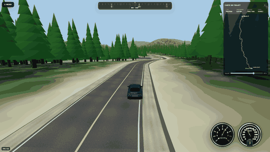

# World Drive

**World Drive** est un simulateur de conduite 3D qui permet de parcourir des routes réelles presque n’importe où dans le monde à partir de données géographiques.

Construit avec **Three.js**, **Vite** et **Electron**, le projet combine routes OpenStreetMap, relief réel, imagerie satellite, génération procédurale, physique automobile, véhicules 3D détaillés, forêt dynamique, streaming du monde, multijoueur LAN et trafic civil léger.

L’objectif n’est pas de reproduire une carte fermée : **World Drive construit et renouvelle le monde autour du joueur au fil du trajet choisi**.

## Fonctionnalités principales

- **Routes et trajets réels** avec recherche de lieux, géocodage et données OpenStreetMap.
- **Relief réel et terrain dynamique** avec rendu proche, moyen et lointain.
- **Imagerie satellite / aérienne** intégrée au terrain, avec fallback procédural lorsque les tuiles ne sont pas disponibles.
- **Streaming continu du monde et floating origin** pour conserver précision et fluidité sur de longs trajets.
- **Forêt dynamique streamée par chunks**, avec priorité devant le véhicule, rétention des chunks et préchargement progressif.
- **Physique de conduite semi-réaliste** : suspension roue par roue, transfert de charge, adhérence, friction circle, sous-virage, survirage, freinage, accélération, transmission, crêtes, état airborne et atterrissages obliques.
- **Banking routier basé sur la courbure**, avec dévers intérieur sur les courbes persistantes et suppression du camber adverse arbitraire.
- **Véhicules haute fidélité** avec roues animées, braquage, phares, feux arrière, freinage, recul, clignotants et instrumentation adaptée.
- **Camion 6x4 avec semi-remorque articulée**, masse propre, multi-essieux, marche arrière et dynamique spécifique.
- **Trafic civil léger et varié**, volontairement peu dense, avec véhicules apparaissant au loin ou croisant le joueur.
- **Pool de trafic de 11 véhicules** : Hyundai Sonata plus dix silhouettes civiles génériques (compacte, coupé, hatchback, minivan, off-road, pickup, sedan, sport, SUV et wagon).
- **Trafic civil synchronisé en multijoueur** : les joueurs d’une même session voient les mêmes véhicules au même endroit, dans la même voie et avec la même vitesse.
- **Décor géographique** : eau, ponts, bâtiments, forêt, panneaux routiers, noms de routes et limites de vitesse.
- **Instrumentation dynamique** avec compteur de vitesse, tachymètre ou affichage EV, rapport engagé et boussole.
- **Clavier et manette**, assistance de voie, pilote automatique et plusieurs caméras.
- **Multijoueur LAN** avec hébergement ou connexion directe dans la version Windows.
- **Cache local IndexedDB** pour accélérer les chargements suivants des données géographiques et de l’imagerie.

## Aperçu

<p align="center">
  
</p>

<p align="center">
  <em>Conduite sur une longue route forestière avec relief streamé, minimap de trajet et multijoueur LAN.</em>
</p>

---

# État actuel — V21.31

La branche `main` correspond maintenant à la base V21.31 enrichie des travaux récents sur la performance, la géométrie routière et le trafic civil.

## Streaming et performance

Une grande partie du travail récent a porté sur la réduction des micro-saccades pendant la conduite et sur le déplacement des coûts lourds hors des frames critiques.

Principales améliorations :

- préparation incrémentale du terrain et de l’horizon;
- double-buffer du terrain lointain;
- préconstruction des transitions de route hors scène;
- conservation de la forêt lors des commits normaux du monde;
- priorité de génération de forêt devant le véhicule;
- préchargement roulant des chunks;
- instrumentation détaillée des hitches et du temps CPU par frame;
- diagnostic des Long Animation Frames du navigateur;
- préchargement des assets lourds du trafic civil au démarrage plutôt qu’en pleine conduite.

L’objectif reste simple : **maintenir la qualité visuelle tout en évitant les pauses perceptibles pendant le roulage**.

## Géométrie routière et banking

Le banking de la route n’est plus une simple conséquence du relief local.

Le système actuel :

- mesure la courbure du tracé horizontal;
- estime le rayon local de la courbe;
- applique un dévers vers l’intérieur des courbes persistantes;
- limite le banking à environ **6°** dans les virages serrés;
- conserve seulement un léger crossfall sur les lignes droites;
- interdit le camber adverse prolongé;
- utilise le même profil final pour le mesh de route, `roadSurfaceAt` et la physique.

Le résultat est beaucoup plus naturel sur les longues courbes et les routes de montagne.

## Trafic civil

World Drive dispose maintenant d’un trafic civil volontairement léger : typiquement une ou deux voitures de temps en temps, plutôt qu’un flux dense.

Le système actuel gère :

- maximum **2 véhicules civils actifs**;
- circulation à droite;
- véhicules venant en sens inverse ou roulant devant le joueur;
- apparition entre environ **360 et 690 m** devant le véhicule;
- vitesse adaptée aux courbes;
- suivi exact du profil de route, incluant pente et banking;
- rotation des roues;
- éclairage nocturne et faisceaux de phares;
- pool pondéré de modèles pour éviter les répétitions immédiates;
- préchargement et cache des GLB pour éviter les hangs lors du premier spawn.

### Variété du trafic

Le pool comprend actuellement :

- Hyundai Sonata 2006;
- compacte;
- coupé;
- hatchback;
- minivan;
- off-road;
- pickup;
- sedan;
- sport;
- SUV;
- wagon.

Les informations d’attribution du pack sont conservées dans `assets/traffic/`.

## Trafic synchronisé en multijoueur

Le trafic civil est également synchronisé entre les joueurs d’une même session.

Le premier joueur connecté agit comme **autorité du trafic**. Les autres clients reproduisent son snapshot compact :

- même modèle de véhicule;
- même position le long de la route;
- même voie;
- même direction;
- même vitesse.

Le système supporte aussi :

- le late join;
- les despawns synchronisés;
- la reprise d’autorité lorsqu’un joueur quitte;
- les relais Node et Electron/Windows.

Le trafic reste uniquement présentationnel et ne modifie pas la physique des véhicules joueurs.

## Véhicules haute fidélité

World Drive possède plusieurs véhicules détaillés, notamment :

- Volkswagen ID.4;
- Subaru WRX;
- Honda Civic;
- Hyundai Sonata 2006;
- BMW i3 2017;
- Lamborghini Countach;
- F1 2010;
- camion routier avec semi-remorque.

Selon le véhicule, les systèmes peuvent gérer :

- rotation des pneus et jantes;
- pivots de braquage;
- suspension visuelle;
- phares et faisceaux nocturnes;
- feux de position, freinage, recul et clignotants;
- matériaux de vitres et de carrosserie;
- caméra première personne ou caméra dédiée.

La Sonata pilotable et les Sonata civiles partagent maintenant un rendu de carrosserie nocturne plus cohérent, sans effet d’auto-éclairage artificiel.

---

## Architecture

World Drive est construit comme un ensemble de modules spécialisés autour d’un monde chargé à la demande.

Quelques composants importants :

```text
src/terrain.js                         terrain procédural / DEM
src/elevation.js                       données et sampling d'élévation
src/imagery.js                         imagerie satellite
src/local-world-builder.js             construction du monde local
src/streaming-coordinator.js           cadence, preload et floating origin
src/forest-chunk-streamer.js           streaming de la forêt
src/forest-streaming-policy.js         budgets et priorité des chunks
src/road-geometry.js                   géométrie, surface et banking de la route
src/road-furniture.js                  panneaux et infrastructure routière
src/vehicle-dynamics.js                dynamique automobile
src/truck-trailer.js                   articulation camion / remorque
src/civil-traffic.js                   façade trafic civil / multijoueur
src/civil-traffic-local.js             moteur local du trafic
src/civil-traffic-pool.js              pool de véhicules civils
src/civil-traffic-network-bridge.js    synchronisation réseau du trafic
src/multiplayer.js                     entrée multijoueur
src/multiplayer-client-m3.js           réplication et interpolation des joueurs
src/instrument-cluster.js              instrumentation
src/minimap.js                         carte et lecture des panneaux
```

## Développement et QA

Le projet dispose d’une suite importante de tests et de workflows GitHub Actions couvrant notamment :

- physique automobile;
- freinage en courbe;
- comportement sur les crêtes;
- état airborne et atterrissages;
- banking routier;
- forêt et streaming;
- frame pacing et attribution des hitches;
- rendu WebGL des véhicules;
- multijoueur;
- trafic civil et synchro du trafic;
- build production et code splitting.

## Lancer le projet

```bash
npm install
npm run dev
```

Puis ouvrir l’adresse fournie par Vite, généralement :

```text
http://localhost:5173/
```

## Build production

```bash
npm run build
```

## Application Windows

```bash
npm run desktop
```

Pour fabriquer les packages Electron :

```bash
npm run make
```

## Statut du projet

- **Base actuelle de `main` : V21.31 + trafic civil synchronisé**
- **Plateformes : navigateur via Vite et application Windows via Electron**
- **Développement actif**

World Drive continue d’évoluer autour de quatre priorités : **qualité de conduite, fluidité du streaming, fidélité visuelle et richesse progressive du monde**.
